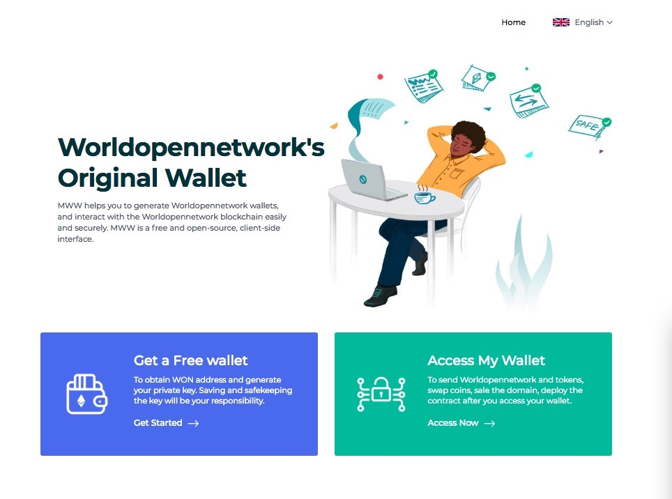

 
 

MyWonWallet is a doorway to the Worldopennetwork blockchain, allowing users to manage their own funds without a centralized platform. -*Stephen, #MEWForce*

## Philosophy
- **Empower the people**: Give people the ability to interact with the Worldopennetwork blockchain easily, without having to run a full node.
- **Make it easy & free**: Everyone should be able to create a wallet and send Ether & Tokens without additional cost.
- **People are the Priority**: People are the most important & their experience trumps all else. If monetization worsens the experience, we don't do it. (e.g. ads)
- **A learning experience, too**: We want to educate about Worldopennetwork, security, privacy, the importance of controlling your own keys, how the blockchain works, and how Worldopennetwork and blockchain technologies enable a better world.
- **If it can be hacked, it will be hacked**: Never save, store, or transmit secret info, like passwords or keys.
- **Offline / Client-Side**: User should be able to run locally and offline without issue.
- **Private**: No tracking!!! No emails. No ads. No demographics. We don't even know how many wallets have been generated, let alone who / what / where you are.
- **Open source & audit-able**

## Getting started
1. Open terminal
2. Clone the repo: `git clone git@github.com:MyWonWallet/MyWonWallet.git`
3. run `npm build`. You can also use the offline version by opening the index file from the dist folder with your preferred browser
4. start `npm start`
5. App should be running in `http://localhost:8080`

## MEW Around the Web

- [Website: https://wallet.1won.com/](https://wallet.1won.com/)
- [CX: https://chrome.google.com/webstore/detail/MyWonWallet-cx/nlbmnnijcnlegkjjpcfjclmcfggfefdm](https://chrome.google.com/webstore/detail/MyWonWallet-cx/nlbmnnijcnlegkjjpcfjclmcfggfefdm)
- [Anti-phish CX](https://chrome.google.com/webstore/detail/etheraddresslookup/pdknmigbbbhmllnmgdfalmedcmcefdfn)
- [FB: https://www.facebook.com/MyWonWallet/](https://www.facebook.com/MyWonWallet/)
- [Twitter: https://twitter.com/MyWonWallet](https://twitter.com/MyWonWallet)
- [Medium: https://medium.com/@MyWonWallet](https://medium.com/@MyWonWallet)
- [Github MEW Repo: https://github.com/WONDevelopment/mywonwallet](https://github.com/WONDevelopment/mywonwallet)
- [Github MEW Org: https://github.com/MyWonWallet](https://github.com/MyWonWallet)
- [Github Latest Releases: https://github.com/WONDevelopment/mywonwallet/releases/latest](https://github.com/WONDevelopment/mywonwallet/releases/latest)
-  MEW WON Donation Address: 0xDECAF9CD2367cdbb726E904cD6397eDFcAe6068D (mewtopia.eth)
-  MEW BTC Donation Address: 1DECAF2uSpFTP4L1fAHR8GCLrPqdwdLse9

## Bug / Feature Request
If you find a bug, or want a new feature added, please submit it on the [Github Issues](https://github.com/WONDevelopment/mywonwallet/issues)
